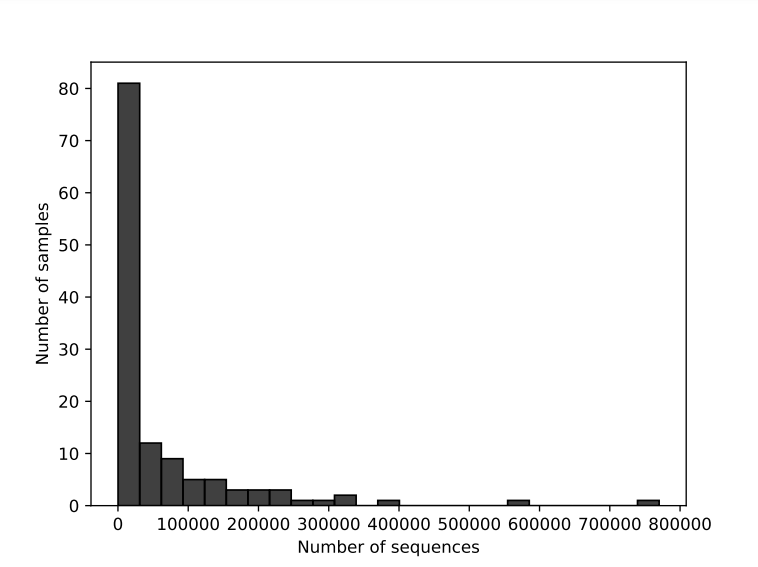

# Logan Wentworth Project
## New England Cyanobacteria Communities
## Author: Logan Wentworth
## Background
This project involves the metabarcoding of cyanobacteria, specifically in the New England area. I downloaded the data from the UNH GEN 711/811 class directory, and focused on processing the data through qiime2 for future uses.
## Methods
The sequences used were downloaded from the UNH GEN 711/811 class directory in fastqz format.
A genomics program, as well as qiime 2, were loaded with a conda environment on the school's computing cluster.
All code used to run the trimming, demultiplexing, etc., are detailed in the methods file.
QZA and QZV files were visualized using QIIME 2 View.
Several issues arose during the denoising step, but changing values in the p-trunc-len-f and p-trunc-len-r lines fixed it.
## Findings

Figure 1. Demultiplexed Forward Read Frequency Histogram. Graph was made with visualization.qzv in the QIIME 2 View browser
